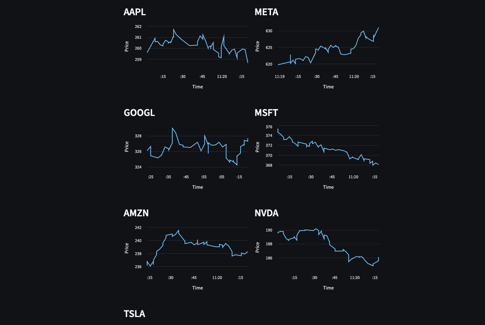
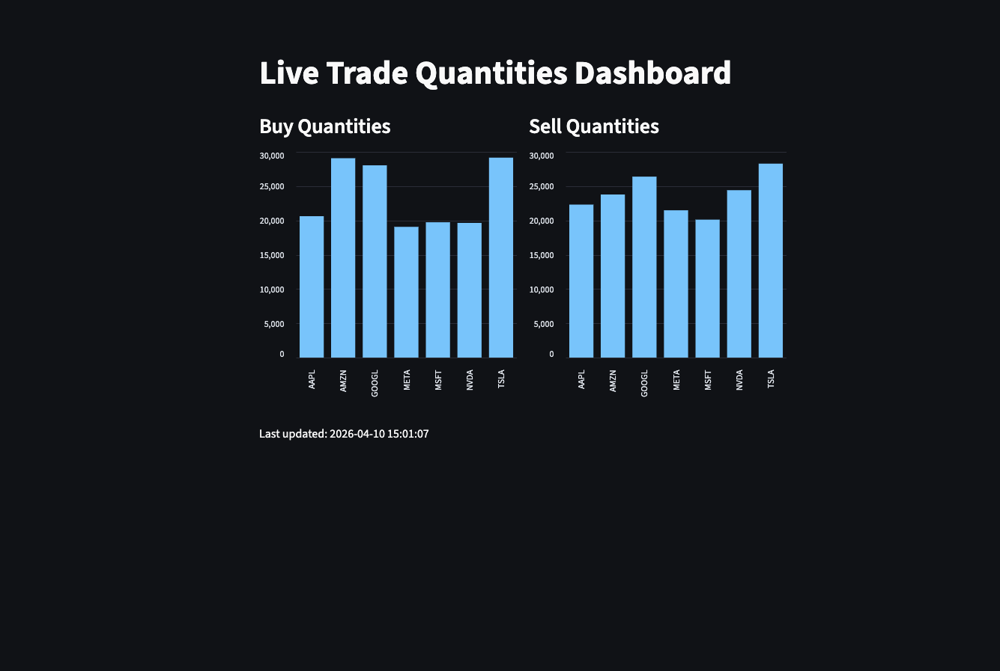
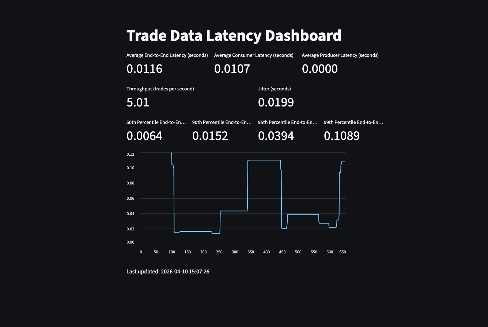

# Mag 7 Stock Streaming Pipeline

## This project looks to simulate streaming market data end-to-end.

## Tech Stack
- Python
- PostgreSQL
- Docker
- Apache Kafka (Docker Image)

In this project I tried to simulate a real-time streaming pipeline. I used the Mag 7 companies (Microsoft, Apple, Meta, Tesla, NVIDIA, Amazon and Google). The data initally starts as real, I use the yfinance Python library to get each of their current stock price, but then use just a basic random walk with some clipping to simulate price movements after the fact, but the point of this project was not to simulate the market, so it does not always work as expected. 

The first script is `marketproducer.py`  
This script generates has the main Python function that generates the call titled `generate_trade_ticker()`, most of the data is generated from the Faker or random Python library. After that there is just standard Kafka code in Python using the `kafka-python-ng` library. Each option has a unique UUID, which is called `trade_id` in the Python function. Each call is confirmed on delivery from the Producer to the Consumer, logging the topic it was sent to, which partition it was assigned to, and its offset a unique sequential ID Kafka assigns to each message within a partition that guarantees ordering and exactly-once tracking. This happens in almost real-time (latency).   

The second script is `marketconsumer.py`. 
This script tries to connect to the Kafka consumer (Docker instance), and then just inserts it into the PostgreSQL database (locally hosted, no Docker). As you will see later, this is nearly where all the latency happens in the pipeline, mostly because writing to Postgres is currently unoptimized on my end, but it is nearly real-time still at 10 ms. 

The three other main Python scripts are Streamlit dashboards

`liveprice.py`
This streamlit dashboard shows price movements of each of the tickers within the past minute, each second is show and is a line chart. It updates every 5 seconds and has the most recent 50 events. Here is an image: 

`quantitydashboard.py`
This streamlit dashboards shows the quantity of each stock for buy and sell options from the moment the data starting streaming. There are no checks or resets, so it could be fine tuned. Here is an image:

`health.py`
This streamlit dashboard show latency metrics for the pipeline. It shows the average end-to-end latency, average consumer latency and average producer latency for each trade. It also shows the throughput (trades per second), Jitter(standrd deviation of the end to end latency). Additonally, this dashboard shows the 50,75,90 and 99th percentile of for the end-to-end metric. Finally this dashboard has a rolling average of the 99th percentile on a graph. I think what is interesting is how much worse the 99th percentile is compared to the 95th. To me that shows that something is stalling whether it be Python or Postgres or even Docker, which is honestly to be expected in a local enviroment. The average latency is only 11 ms, which is still very good. 
Here is an image:

